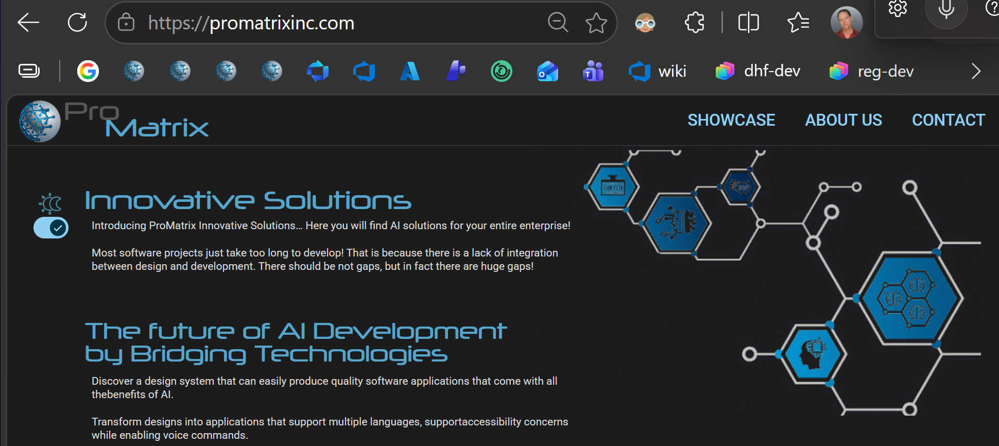
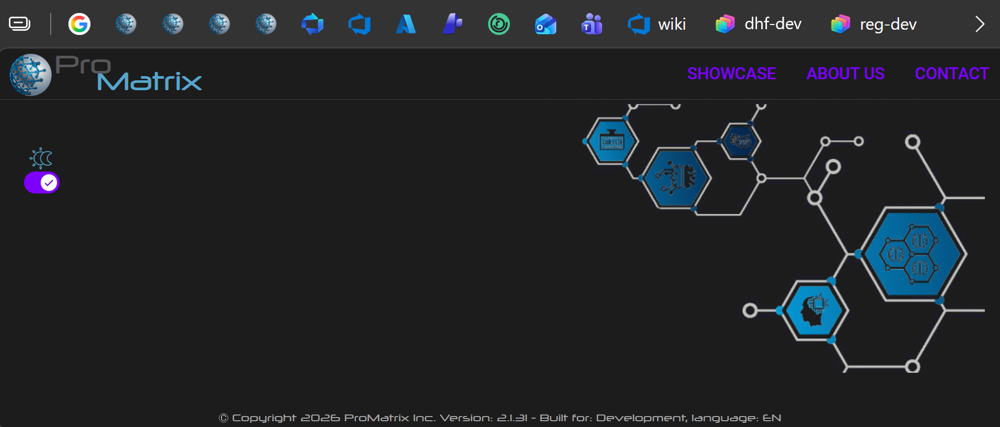

My goal is to:  
I updated this Visual Studio workspace to the latest versions in the package.json, and now I am having problems with the UI. Things are missing and there's wrong colors and so on.

In this ADR we will concentrate on the landing page.  
Here is an image of what the landing page should look like:

Here is an image of what the landing page looks like now with missing text, wrong color in the top nav:

Note: Some things may out of view and unavailable for review.

Identify what things you can fix?  
Fix the things that you identify.

Read and follow these system instructions:  
C:/adr/prompts/narrow-request.md  
C:/adr/prompts/append-prompt.md  
C:/adr/prompts/scripting-assistance.md  
C:/adr/prompts/increment-adr-counter.md  
C:/adr/prompts/solution-summary.md

1. Should the first screenshot be treated as the visual source of truth for the desktop landing page?
	- A. Yes, match it as closely as practical for the visible landing page.
	- B. Restore only the missing text and the incorrect top navigation color.
	- C. Use the screenshot as guidance, but preserve the current upgraded theme wherever it conflicts.

2. Which missing landing page text should be restored?
	- A. Restore all visible text from the first screenshot, including headings and body copy.
	- B. Restore only the hero/title text and leave secondary paragraphs hidden or omitted.
	- C. Keep the existing DOM/content and fix only CSS visibility/layout issues.

3. What should the top navigation link color be after the fix?
	- A. Light cyan/blue like the first screenshot.
	- B. Keep the current purple if it comes from the upgraded Material theme.
	- C. Use the project brand color variables if they differ from both screenshots.
